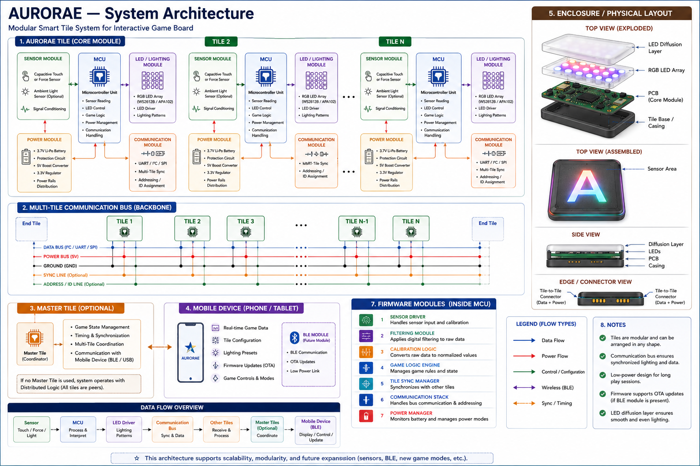

# AURORAE

**AURORAE is a modular smart tabletop gaming platform that brings lighting, sensing, embedded logic, and physical gameplay together.**

The Phase 1 prototype is a 5x5 proof-of-concept board using an ESP32 controller, WS2812B addressable LEDs, NFC/RFID tile detection, and simple word/game logic. The goal is to prove that physical letter tiles can be detected, mapped to board positions, and used to trigger scoring, lighting feedback, and interactive gameplay.

> Status: Phase 1 build in progress. Parts are being assembled for the first functional 5x5 prototype. This repository documents the architecture, build direction, and prototype evidence as AURORAE moves from concept to working hardware.



## What This Repository Contains

- **System architecture**: modular board units, MCU, sensors, LEDs, communication, power, and game logic.
- **Phase 1 prototype plan**: ESP32, WS2812B lighting, NFC tile detection, common-ground wiring, and test firmware.
- **Modularity research**: how tiles/boards can connect physically, electrically, and logically.
- **Interaction design**: lighting feedback, tile sensing, game states, word detection, scoring, and future multi-board play.
- **Roadmap**: concept prototype, V0 multi-board prototype, V1 refinement, and future product direction.

## Phase 1 Prototype

The first hardware build focuses on a compact 5x5 board so the core interaction can be proven quickly.

| Subsystem | Phase 1 Choice | Goal |
|---|---|---|
| Controller | ESP32 dev board | Run test firmware, read sensors, and control LEDs. |
| Lighting | WS2812B addressable LEDs | Show board state, tile feedback, and game events. |
| Tile detection | NFC/RFID reader + tagged tiles | Detect placed letters and tile identity. |
| Power | External 5V supply with shared ground | Provide stable LED power without overloading the ESP32. |
| Logic | Simple word demo | Detect basic words such as CAT or DOG and show score feedback. |

## Build Sequence

1. Confirm ESP32 programming works.
2. Test WS2812B LEDs with a rainbow sketch.
3. Test NFC/RFID tag reading on the serial monitor.
4. Combine NFC input with LED feedback.
5. Assemble the 5x5 grid.
6. Map LEDs and tile positions.
7. Demonstrate a simple word-detection and scoring loop.
8. Record a short working prototype video.

## Architecture

AURORAE is designed as a modular tile system. Each board unit can contain sensing, lighting, local processing, power management, and communication. Future versions can expand from a single 5x5 proof-of-concept into larger boards, multi-board communication, educational modes, and tournament-style word gameplay.

Read more:

- [System architecture](docs/architecture/system_architecture.md)
- [Hardware and firmware interaction](docs/architecture/hw_fw_interaction.md)

## Core Documentation

- [Modular board concept](docs/modularity/modular_board_concept.md)
- [Lighting and sensor integration](docs/integration/lighting_sensor_integration.md)
- [Interaction patterns](docs/interaction/interaction_patterns.md)
- [Communication protocol](docs/communication/communication_protocol.md)
- [Project roadmap](docs/roadmap/roadmap.md)

## Current Prototype Questions

The Phase 1 build is intended to answer:

- Can a low-cost ESP32 reliably control the LED layer and read tile events?
- Which NFC/RFID approach is practical for tile identity detection at prototype scale?
- How should board coordinates map to tile identity, LED feedback, and score logic?
- What wiring layout is stable enough for a repeatable demo?
- What evidence is strong enough for GitHub, funders, partners, and early investors?

## Repository Structure

```text
docs/
  architecture/
    diagrams/
    system_architecture.md
    hw_fw_interaction.md
  communication/
  integration/
  interaction/
  modularity/
  roadmap/
hardware/        # future PCB, enclosure, and mechanical files
src/             # future firmware and game logic
```

## Safety and Scope

AURORAE is currently a prototype platform. Phase 1 should be built using staged tests: power first, LEDs second, NFC third, then integration. Always power off before wiring changes, keep all grounds common, avoid exposed conductors, and verify voltage before connecting modules.

## License

License to be added.

